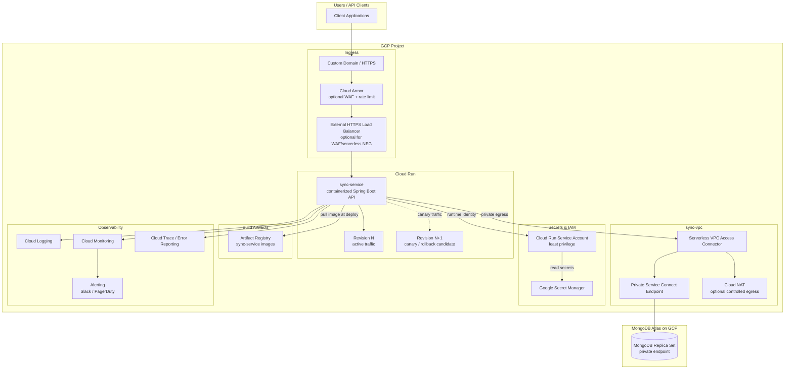
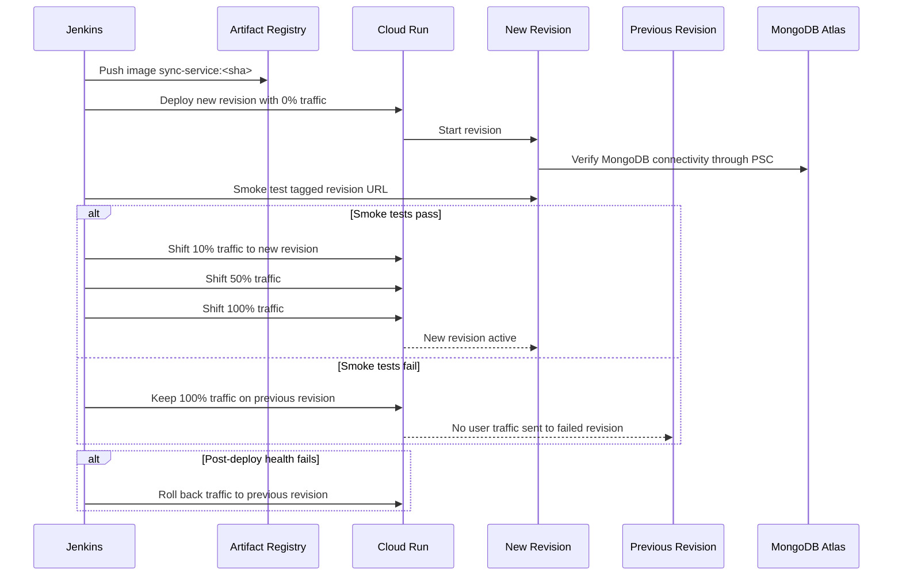

# Architecture Diagram — Cloud Run Option

## Rendered Diagram

Open this SVG in a browser or embed it in the README:

[sync-service-cloud-run-architecture.svg](sync-service-cloud-run-architecture.svg)

## Deployment Flow

